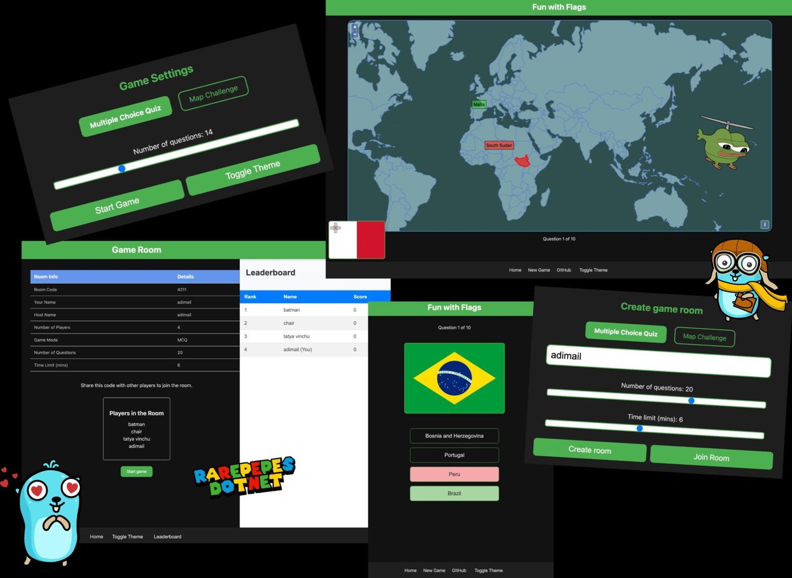
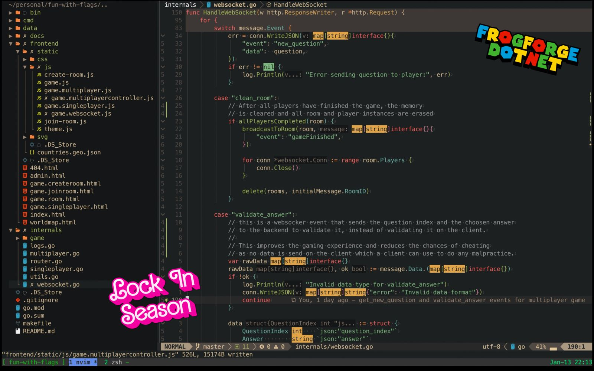

# Fun with Flags

## Overview

"Fun with Flags" is a web-based multiplayer game where players identify flags of different countries. The game is designed for both single-player and multiplayer modes where users to create and join game rooms.

## Game Rules

- Players are presented with a list of flags and must identify the correct flag for the given country.
- The game starts when the host starts the game.
- Each game has a timer that counts down from the selected time limit (3 to 10 minutes).
- Players can join the game room using the unique room code generated when the room is created.

## Screenshots

